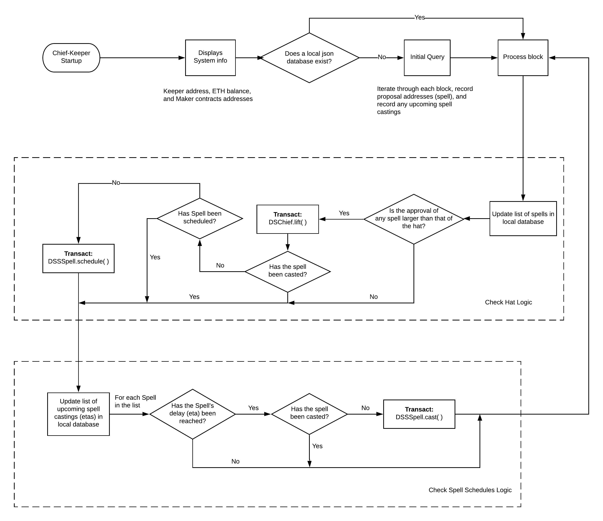

# chief-keeper

**Still under active development**

Commonly known as the `Mad Hatter`, the `chief-keeper` monitors and interacts with [DS-Chief](https://github.com/dapphub/ds-chief), the executive voting contract, and [DS-Pause](https://github.com/dapphub/ds-pause), the Governance Security Module (GSM), of the [Maker Protocol](https://github.com/makerdao/dss).

While in operation, the `chief-keeper`:
* Monitors each new block for a change in the state of executive votes
* `lift()`s the hat for the proposal (`yay`) most favored (`approvals[yay]`)
* Schedules proposals in the GSM (i.e. `plot` a `plan`)
* Executes proposals after their `plot` has elapsed in the GSM

### Prerequisites
TBA

## Architecture


## Operation

This keeper is run continuously, and saves a local database of `yays` to minimize chain state reads.
If you'd like to create your own database from scratch, first delete `src/yays_db_mainnet.json` before running `bin/chief-keeper`; the initial query of all `yays` could take up to 15 minutes.

### Installation

This project uses *Python 3.6.2*.

In order to clone the project and install required third-party packages please execute:
```
git clone https://github.com/makerdao/chief-keeper.git
cd chief-keeper
git submodule update --init --recursive
./install.sh
pip3 install tinydb
```

For some known Ubuntu and macOS issues see the [pymaker](https://github.com/makerdao/pymaker) README.


### Sample Startup Script

Make a run-cage-keeper.sh to easily spin up the cage-keeper.

```
#!/bin/bash
/full/path/to/chief-keeper/bin/chief-keeper \
	--rpc-host 'sample.ParityNode.com' \
	--network 'kovan' \
	--eth-from '0xABCAddress' \
	--eth-key 'key_file=/full/path/to/keystoreFile.json,pass_file=/full/path/to/passphrase/file.txt' \
	--chief-deployment-block 14374534
```


## Testing

Prerequisites:
* Download [docker and docker-compose](https://www.docker.com/get-started)

This project uses [pytest](https://docs.pytest.org/en/latest/) for unit testing.  Testing of Multi-collateral Dai is
performed on a Dockerized local testchain included in `tests\config`.

In order to be able to run tests, please install development dependencies first by executing:
```
pip3 install -r requirements-dev.txt
```

You can then run all tests with:
```
./test.sh
```

## Roadmap


## License

See [COPYING](https://github.com/makerdao/chief-keeper/blob/master/COPYING) file.

### Disclaimer

YOU (MEANING ANY INDIVIDUAL OR ENTITY ACCESSING, USING OR BOTH THE SOFTWARE INCLUDED IN THIS GITHUB REPOSITORY) EXPRESSLY UNDERSTAND AND AGREE THAT YOUR USE OF THE SOFTWARE IS AT YOUR SOLE RISK.
THE SOFTWARE IN THIS GITHUB REPOSITORY IS PROVIDED “AS IS”, WITHOUT WARRANTY OF ANY KIND, EXPRESS OR IMPLIED, INCLUDING BUT NOT LIMITED TO THE WARRANTIES OF MERCHANTABILITY, FITNESS FOR A PARTICULAR PURPOSE AND NONINFRINGEMENT. IN NO EVENT SHALL THE AUTHORS OR COPYRIGHT HOLDERS BE LIABLE FOR ANY CLAIM, DAMAGES OR OTHER LIABILITY, WHETHER IN AN ACTION OF CONTRACT, TORT OR OTHERWISE, ARISING FROM, OUT OF OR IN CONNECTION WITH THE SOFTWARE OR THE USE OR OTHER DEALINGS IN THE SOFTWARE.
YOU RELEASE AUTHORS OR COPYRIGHT HOLDERS FROM ALL LIABILITY FOR YOU HAVING ACQUIRED OR NOT ACQUIRED CONTENT IN THIS GITHUB REPOSITORY. THE AUTHORS OR COPYRIGHT HOLDERS MAKE NO REPRESENTATIONS CONCERNING ANY CONTENT CONTAINED IN OR ACCESSED THROUGH THE SERVICE, AND THE AUTHORS OR COPYRIGHT HOLDERS WILL NOT BE RESPONSIBLE OR LIABLE FOR THE ACCURACY, COPYRIGHT COMPLIANCE, LEGALITY OR DECENCY OF MATERIAL CONTAINED IN OR ACCESSED THROUGH THIS GITHUB REPOSITORY.
